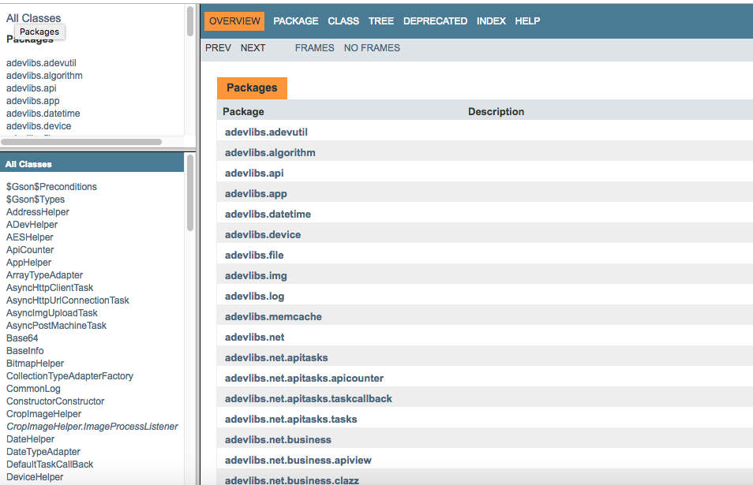

# adevlibs
common used android develop libs 


# 源代码中包含了android开发常用的一些工具类库

*	adevutil包

```
SharedPreference 操作的封装 （方数据 和 取数据）、对话框展示的封装 （单按钮对话框 和 双按钮对话框）、dp和像素sp之间的转换。。。

```

*	algorithm包

```
AES Base64 MD5 其他常用算法。。。
```

*	api包

```
模拟创建假数据。。。
```

*	app包

```
针对Android Apk的一些操作：卸载  shortcut 版本信息 窗口尺寸信息。。。
```

*	datetime包

```
常用的时间操作： 字符串对应的日期是周几、日期之间的先后关系、日期之间的间隔、ate和String之间的转换、long和日期String之间的转换、long和Date之间的转换、int和Date之间的转换。。。
```

*	device包

```
常用的device操作： imei mac cupserial sdcard状态。。。
```

*	file包

```
常用的file操作： 创建目录,创建文件,通过命令行删，通过递归的方式删,将内容写入指定文件中可以选择覆盖和追加的方式，对私有文件写入也有支持,文件是否存在，读取文件内容对私有文件也有支持，文件名解析，MIME类型获取,文件复制。。。
```

*	img包

```
常用的img操作： 资源的加载（从resource中和从stream中），图片保存到sd卡，图片任意形状的放大缩小,从资源ID读取图片，反转，圆角，修改alpha通道，合并，通过抽样压缩。。。
```

*	log包

```
常用的log操作： 无缝是配合android系统的log，扩充了log输出内容以及将log保存到文件系统。。。
```

*	memcache包

```
参考android原生代码LruCache。。。
```

*	net包

```
自己封装的网络请求和hook工具。底层使用HttpClient 和 HttpUrlConnection两种方式。。。
```

*	pingying包

```
常用的pingying操作： 汉子高效转成拼音，以及拼音转汉字，获取字符串对应的拼音首字母。。。
```

*	sound包

```
常用的声音操作：播放声音以及连续播放的时候瞬间停止前面的声音（适合场景“摇一摇手机发出声音”）。。。
```

*	string包

```
常用的业务stirng操作： 邮政编码验证，手机号码验证，邮箱格式验证，常用界面时间展示格式，检查是否是汉字，检查是否是纯数字。。。
```


# 文档位置
*	文档在 ***adevlibs-doc*** 目录下.
*  文档在github上不能直接查看，需要下载到本地然后用浏览器打开***adevlibs-doc/index.html***就能浏览。(见下图)  
*  

	

